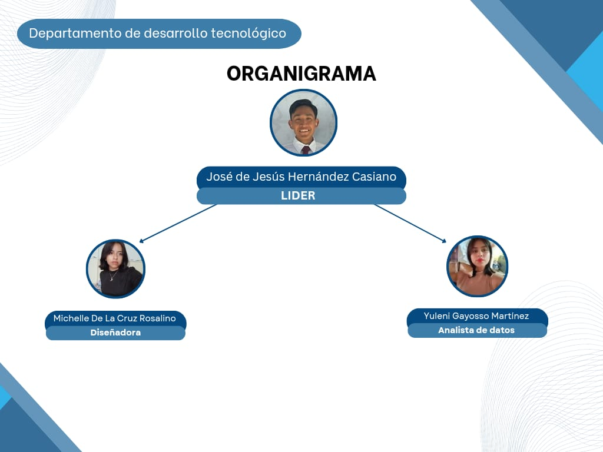

# DEPARTAMENTO DE DESARROLLO TECNOLOGICO
#### Misión
Incrementar el número de proyectos que tengan un impacto en la sociedad
#### Visión
Generar avances tecnológicos en torno a las nuevas modalidades y estilos de vida que constantemente evolucionan 
#### Valores
- **Responsabilidad:** Entregamos en tiempo y forma todos los proyectos asignados
dentro de la empresa.
- **Innovación:** Creamos y mejoramos avances tecnológicos conforme la tecnología vaya
evolucionando.
- **Empatía:** Mejoramiento laboral, apoyo entre compañeros de equipo.
- **Seguridad:** Proporcionalmente de un protocolo de seguridad a los proyectos que se
lleven a cabo dentro de la empresa.

 

  
 

  ## SERVICIO
#### Objetivo General
Desarrollar un sistema de control autónomo de un dron agricultor que permita realizar actividades
agrícolas, reduciendo al mínimo la intervención humana y maximizando la cobertura de cultivos al
menor tiempo posible.
####Objetivos Particulares
- Implementar una página web para promocionar tanto servicio como producto.
- Dar conocimiento sobre los diferentes tipos de drones que se ocupan dentro de la
agricultura.
- Implementar una aplicación que nos permita la manipulación del dron con intervención
humana.
- Mejorar la eficiencia y rendimiento de las actividades agrícolas con el uso de dron de
fumigación.

## Planteamiento del problema
En la agricultura se presentan desafíos como la fertilización, el tiempo de carga y descarga,
cobertura de área de cultivo y fumigación del campo, un dron nos ayudara a la optimización de
tareas anteriormente mencionadas.
Se desarrollarán estrategias y tecnologías que permitan optimizar el tiempo empleado en las
operaciones con un dron agrícola, mejorando así la eficiencia y rendimiento de las actividades
agrícolas, reducirá el tiempo de vuelo, maximizara la cobertura del área de cultivo en cada vuelo, y
se minimizaran los tiempos de carga y descargas de equipos y datos.

## Justificación
Se basa en la optimización de tiempo con uso del UAV debido a sus implicaciones en eficiencia,
seguridad y rentabilidad de las actividades agrícolas con esto el dron nos ayudara a la recopilación
de datos para la toma de decisiones informada con la gestión de cultivos. Al optimizar el tiempo
empleado en la recopilación de datos el agricultor puede tomar decisiones más rápido y precisas lo
que puede generar un impacto positivo en la productividad y rendimiento de los cultivos.

## 1. Titulos HEADERS

Si para la documentacion deseamos secciones de alguntema o contenido podemos utilizar estos elmentos para poner textos resaltados como encabezados. Estos son similares a las etiquetas /<h1>...<h6>

**EJEMPLO**

# Titulo Principal (Nivel 1)
## Subtitulo de Nivel 2
### Subtitulo de Nivel 3
#### Subtitulo de Nivel 4
##### Subtitulo de Nivel 5
###### Subtitulo de Nivel 6
####### El estandar solo te permite hasta 6 posibles titulos, a partir del septimo omitira la instruccion de maquetado

## 2. Separadores (SEPARATORS)

Esta instruccion coloca una linea vertical entre las secciones del documento permitiendo organizar y distribuir mejor el contenido, y puede ser maquetado utilizando 3 guiones medios (-) continuos despues del parrafo deseado.

**EJEMPLO**

Parrafo 1  Parrafo 1  Parrafo 1 Parrafo 1 Parrafo 1
---
Parrafo 2  Parrafo 2  Parrafo 2  Parrafo 2  Parrafo 2

## 3. Parrafos (PARAGRAPHS)

Son utilizados para presentar texto descriptivo de la documentacion de los proyectos, en el cual podremos utilizar la propíedad de  *align* de HTML para poder controlar la alineacion de texto

**EJEMPLO**

Parrafo 1 en caso de no definir la alineacion estara por defecto a la izquierda Parrafo 1 en caso de no definir la alineacion estara por defecto a la izquierda Parrafo 1 en caso de no definir la alineacion estara por defecto a la izquierda Parrafo 1 en caso de no definir la alineacion estara por defecto a la izquierda Parrafo 1 en caso de no definir la alineacion estara por defecto a la izquierda Parrafo 1 en caso de no definir la alineacion estara por defecto a la izquierda

 Parrafo 2 al utilizar la etiqueta p y la propiedad de alineacion con el valor right, este estara alineado a la derecha Parrafo 2 al utilizar la etiqueta p y la propiedad de alineacion con el valor right, este estara alineado a la derecha Parrafo 2 al utilizar la etiqueta p y la propiedad de alineacion con el valor right, este estara alineado a la derecha Parrafo 2 al utilizar la etiqueta p y la propiedad de alineacion con el valor right, este estara alineado a la derecha 

 Parrafo 3 este texto estara centrado Parrafo 3 este texto estara centrado Parrafo 3 este texto estara centrado Parrafo 3 este texto estara centrado Parrafo 3 este texto estara centrado Parrafo 3 este texto estara centrado Parrafo 3 este texto estara centrado Parrafo 3 este texto estara centrado Parrafo 3 este texto estara centrado Parrafo 3 este texto estara centrado Parrafo 3 este texto estara centrado Parrafo 3 este texto estara centrado Parrafo 3 este texto estara centrado 

 Algunas veces desearemos  justificar el texto para presentar el texto de una manera mas organizada Algunas veces desearemos  justificar el texto para presentar el texto de una manera mas organizada Algunas veces desearemos  justificar el texto para presentar el texto de una manera mas organizada Algunas veces desearemos  justificar el texto para presentar el texto de una manera mas organizada Algunas veces desearemos  justificar el texto para presentar el texto de una manera mas organizada

## 4. Texto Enfatizado (BOLD, ITALIC, ITALIC/BOLD y UNDERLINE)

Tambien es posible resaltar algunas palabras importantes utilizando la estilizacion de **Letras Negritas**, para la que colocaremos dos * antes y despues de la palabra a resaltar, *Letras Cursivas* solo ponemos un * antes y despues de las palabras, ***Letras Cursivas y Negritas*** colocando 3 y por ultimo <ins>texto subrayado<ins> encerrando la frase o palabra entre la etiqueta <ins> y la etiqueta de cierre <ins>

** 5. Cuadores de Codigo o Reseña (BLOCKQUOTES)

Estos elementos son utilizados para resaltar instrucciones especificas para la instalacion, configuracion y/o inicializacion delproyecto, para mostrar secciones de codigo fuente y se maqueta utilizando el simbolo de mayor que (>) antes del texto.

**EJEMPLO**

Para listar las carpetas y archivos desde una terminal de comandos en el SO de Windows debemos usar el comando

> C:/dir
Despues oprimimos la tecla *Enter*

Tambien podemos poner texto multilinea

**EJEMPLO**

Pasos para instalar MySQL
> - Descargar el archivo instalador desde la pagina oficial www.mysql.com
> - Instalar el servidor de Bases de Datos
> - Definir el puerto y contraseña para el usuario **root**
> - Inicializar el servidor de Base de Datos
> - Conectarnos a la Base de Datos para verificar que se instalo correctamente

## 6. Listas Ordenadas y NO Ordenadas 

Si en nuestra documentacion necesitamos incluir informacion en modo de lista, es decir un elemento tras otro podremos hacerlo utilizando las listas ya sea usando viñetas o numeracion definida.

Para el uso de las viñetas solo es necesario agregar un (-) antes del texto

**EJEMPLO**

Mi tipo favorito de musica es:
- Balada
- Rock
- Electro House
- Pop

Para enlistar elementos en orden numerico solo basta con anteponer un numero antes del texto con un (.)

**EJEMPLO**

Para crear un nuevo repositorio en **GitHub** debo:
1. Crear una cuenta deGitHub
2. Logearme con mi cuenta de GitHub
3. Ir al menu principal de mi perfil (Home)
4. En el menu lateral buscar el boton que dice **Nuevo Repositorio**
5. Asignarle un nombre
6. Definir si el proyecto es:
       -**Publico:** Cualquier persona podra ver y consultar el contenido de mi proyecto
       -**Privado:** Solo aquella persona que yo autorize podran vizualisar y modificar el contenido de mi proyecto
7. Agregar un primer archivo documental *README.md*
8. Aprobar la creacion de repositorio

## 7. Ligas e Hipervinculos (LINKS)

Estas son utilizadas para redirigir a archivos o secciones dentro o fuera de nuestro repositorio. Se maquetan utilizando corchetes [], inmediatamente de parentesis con la url de destino ().

**EJEMPLO**

Mi buscador favorito es: [GOOGLE] (https://www.google.com)

Esta documentacion fue creada por **Jose de Jesus Hdz. Casiano**
<casianojose.24@gmail.com>

## 8. Tablas (TABLES)

Si la documentacion lo requiere podemos podemos presentar informacion en formatos de tablas con filas y columnas, para maquetarlas podemos utilizar el caracter | para delimitar las columnas y - para delimitar las filas

 **EJEMPLO**

 ------------------------------------------------------------
 | Encabezado 1 | Encabezado 2 | Encabezado 3 | Encabezado 4 |
 |--------------| -------------| -------------|--------------|
 | Fila 1 Celda | Fila 2 Celda | Fila 3 Celda | Fila 4 Celda | 
 | Fila 1 Celda | Fila 2 Celda | Fila 3 Celda | Fila 4 Celda | 
 | Fila 1 Celda | Fila 2 Celda | Fila 3 Celda | Fila 4 Celda | 

## 9. **Imagenes

Para la vizualisacion de imagenes debemos cargar los archivos en nuestro repositorio y vincularlo
[Pika-Pi](pikagit.png)

# Plan de Implementación:

##        1.Fase de Diseño y Desarrollo:
              - Selección de proveedores para componentes clave del dron y sistemas de fumigación.
              - Diseño y prototipado del dron y sistemas de control.
              - Pruebas de laboratorio y simulaciones de vuelo para validar la capacidad de carga automatica.

##        2.Fase de iplementación:
              - Constrcción del dron y sistemas de soporte terrestre.
              - Pruebas de vuelo en condiciones controladas y ajustes de sofware y hadware.
              - Capacitación del personal operativo en el manejo del dron y sistemas de control.
              
##        3.Fase de Operación y Monitoreo:
              -Implementación del dron en operaciones piloto en campos de maíz seleccionados.
              -Monitoreo continuo de la eficacia del tratamiento y ajustes según sea necesario.
              -Recolección de datos sobre la cobertura, consumo de pesticidas y eficiencia operativa del dron.

## Cronograma y Recursos:
              °Duración del proyecto: 8 meses.
              °Recursos requeridos: Equipode desarollo (Ingenieros, Diseñadores), personal de operación (Pilotos, Técnicos), equipo y materiales de construcción.

