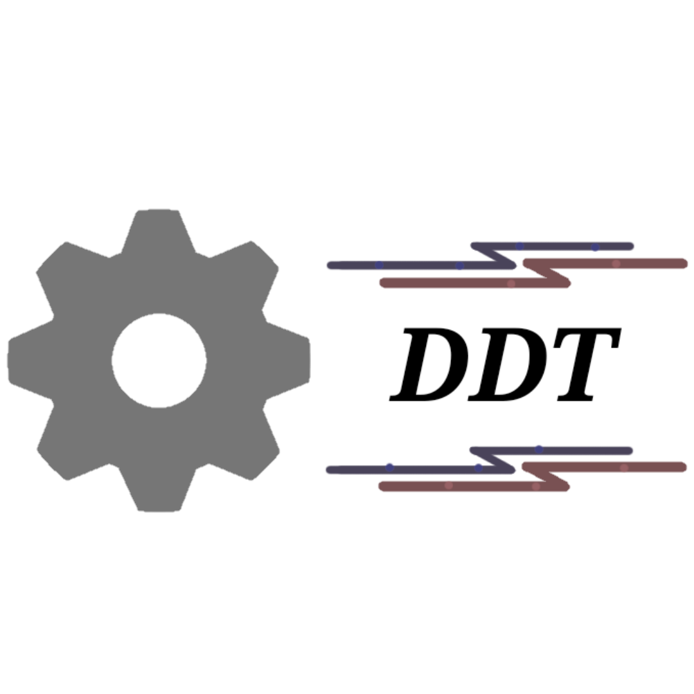
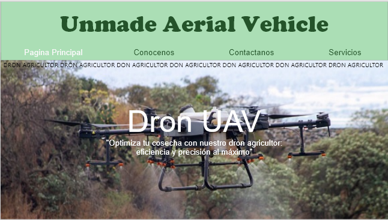
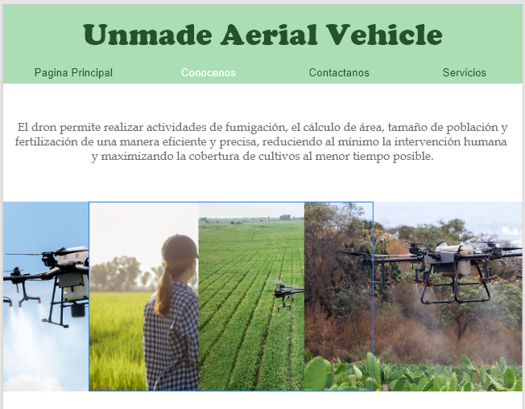
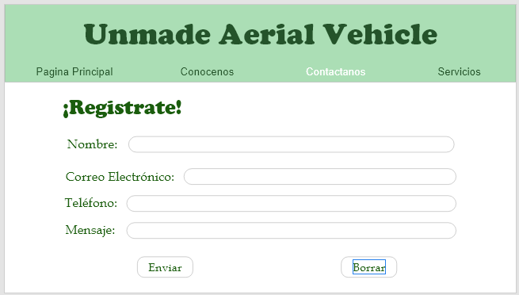
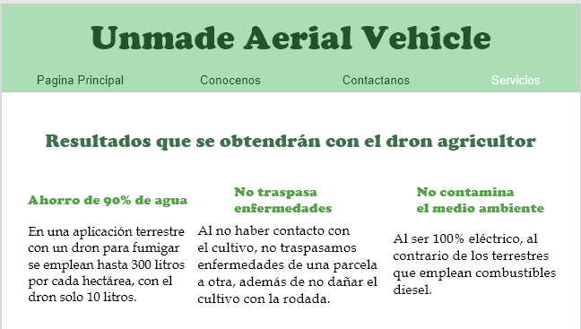
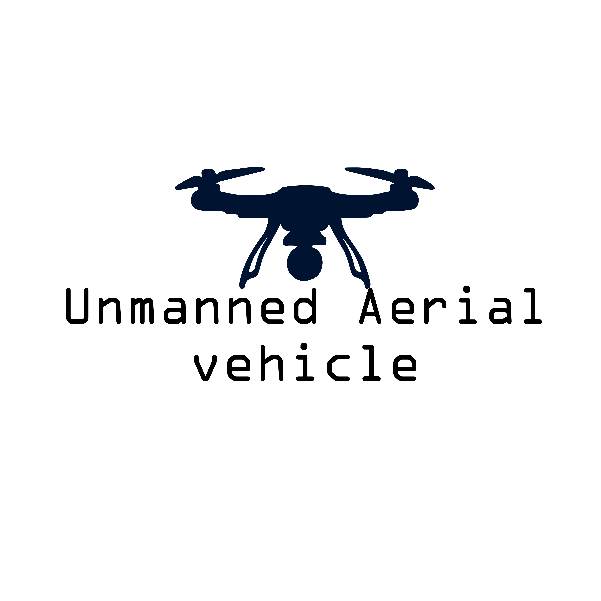

# LOGOTIPO DE LA EMPRESA

  
 

# DEPARTAMENTO DE DESARROLLO TECNOLOGICO
## Misión
Incrementar el número de proyectos que tengan un impacto en la sociedad
## Visión
Generar avances tecnológicos en torno a las nuevas modalidades y estilos de vida que constantemente evolucionan 
## Valores
- **Responsabilidad:** Entregamos en tiempo y forma todos los proyectos asignados
dentro de la empresa.
- **Innovación:** Creamos y mejoramos avances tecnológicos conforme la tecnología vaya evolucionando.
- **Empatía:** Mejoramiento laboral, apoyo entre compañeros de equipo.
- **Seguridad:** Proporcionalmente de un protocolo de seguridad a los proyectos que se lleven a cabo dentro de la empresa.
  
  # Organigrama

 

  
 

  ## SERVICIO
#### Objetivo General

 Desarrollar un sistema de control autónomo de un dron agricultor que permita realizar actividades agrícolas, reduciendo al mínimo la intervención humana y maximizando la cobertura de cultivos al menor tiempo posible.
 

#### Objetivos Particulares
- Implementar una página web para promocionar tanto servicio como producto.
- Dar conocimiento sobre los diferentes tipos de drones que se ocupan dentro de la agricultura.
- Implementar una aplicación que nos permita la manipulación del dron con intervención humana.
- Mejorar la eficiencia y rendimiento de las actividades agrícolas con el uso de dron de fumigación.

## Planteamiento del problema

 En la agricultura se presentan desafíos como la fertilización, el tiempo de carga y descarga, cobertura de área de cultivo y fumigación del campo, un dron nos ayudara a la optimización de tareas anteriormente mencionadas.

 Desarrollar un sistema de control autónomo de un dron agricultor que permita realizar actividades agrícolas, reduciendo al mínimo la intervención humana y maximizando la cobertura de cultivos al menor tiempo posible.

## Justificación

 Se basa en la optimización de tiempo con uso del UAV debido a sus implicaciones en eficiencia, seguridad y rentabilidad de las actividades agrícolas con esto el dron nos ayudara a la recopilación de datos para la toma de decisiones informada con la gestión de cultivos. Al optimizar el tiempo empleado en la recopilación de datos el agricultor puede tomar decisiones más rápido y precisas lo que puede generar un impacto positivo en la productividad y rendimiento de los cultivos.

## Alcance

#### Especificaciones Tecnicas del Dron:
- Capacidad de carga minima de 10 kg de pesticida liquido.
- Autonomia de vuelo de al menos 1 hora.
- Velocidad de vuelo ajustable entre 0 y 50 km/h para adaptarse a diferentes condiciones de viento.
- Sistema de navegación GPS con capacidad de vuelo autónomo.
  
#### Area de Aplicación:
- Aplicaciones en campos de cultivo en la region de Xicotepec de Juarez.
- Condiciones operativas incluyen temperaturas entre 10°C y 35°C, altitudes hasta 1000 metros sobre el nivel del mar, y vientos de hasta 25 km/h.

#### Seguridad: 
- implementacion de medidad de seguridad para proteger al operador, personal en tierra y poblacion cercana a las areas de aplicación.
- Protocolos de emergencia para manejo de accidentes y derrames de pesticidas.

# Plan de Implementación

###        1.Fase de Diseño y Desarrollo

  - Selección de proveedores para componentes clave del dron y sistemas de fumigación.
  - Diseño y prototipado del dron y sistemas de control.
  - Pruebas de laboratorio y simulaciones de vuelo para validar la capacidad de carga automatica.

###        2.Fase de iplementación

  - Constrcción del dron y sistemas de soporte terrestre.
  - Pruebas de vuelo en condiciones controladas y ajustes de sofware y hadware.
  - Capacitación del personal operativo en el manejo del dron y sistemas de control.
              
###        3.Fase de Operación y Monitoreo

  - Implementación del dron en operaciones piloto en campos de maíz seleccionados.
  - Monitoreo continuo de la eficacia del tratamiento y ajustes según sea necesario.
  - Recolección de datos sobre la cobertura, consumo de pesticidas y eficiencia operativa del dron.

### Cronograma y Recursos

  - Duración del proyecto: 8 meses.
  - Recursos requeridos: Equipode desarollo (Ingenieros, Diseñadores), personal de operación (Pilotos, Técnicos), equipo y materiales de construcción.

### Riesgos y Contigencias

  - Riesgos identificados: problemas técnicos con el dron, cambios en la regulación de drones, resistencia de la comunidad local al uso de drones.
  - Planes de contigencias: disponibilidad de piezas de repuesto, colaboración con autoridades para mantenerse actualizados sobre cambios normativos, campañas de sensibilización y educación sobre los beneficios del uso de drones.

### Requerimientos Funcionales y NO Funcionales

#### Requerimientos Funcionales

  - El dron debe ser controlable de forma remota mediante una aplicación móvil o un controlador especifíco.
  - Debe incluir cámaras y sensores para el monitorep en tiempo real del estado de la cosecha.
  - Debe permitir la programación de áreas específicas para fumigar, asegurando una cobertura uniforme.
  - Debe alertar cuando un tanque de gasolina o la pila del motor estén por acabarse.

#### Requerimientos NO Funcionales

  - Capacidad para operar en diferentes condiciones climáticas.
  - Diseño que facilite el mantenimiento y reparación de fallas.
  - Capacidad para operar durante un tiempo prolongado sin necesidad de recarga de combustible o electricidad.

## Requisitos de Usuario

###        1.Conocimiento básico sobre drones

  - Comprender los principios básicos de vuelo y funcionamiento del dron.
  - Conocer las regulaciones locales sobre el uso de drones.
  
###        2. Habilidad en el uso de aplicaciones móviles

  - Familiaridad con la interfaz y funcionalidades de la aplicación movil específica del dron.
  
###        3. Habilidades de Navegación y Control

  - Habilidad para controlar el dron en vuelo utilizando la interfaz táctil de la aplicación.
  
###        4.Conocimiento en configuración y Ajustes

  - Saber configurar parámetros como el límite de altura, distancia, y modos de vuelo en la aplicación.
  
###        5.Conocimiento de seguridad y mantenimineto

  - Comprender como realizar mantenimiento básico y solucionar problemas comunes del dron.

## Requisitos Técnicos

###        1.Dispositivo Móvil Compatible

  - Un smartphone o tableta con sistema operativo compatible (iOS, Android) y especificaciones adecuadas para la aplicación del dron.
  
###        2.Aplicación Móvil Adecuada

  - La aplicación móvil proporcionada o recomendada por el fabricante del dron, descargada desde la tienda de aplicaciónes correspondiente.
  
###        3.Conexión a Internet

  - Para actualizaciónes de software, descargas de mapas, o funcionalidades en la nube.
  
###        4.Conexión Bluetooth o Wi-Fi

  - El dron y el dispositivo móvil deben estar conectados a través de Bluetooth, Wi-Fi, o una conexión directa según el modelo de el dron.
  
###        5.Batería Suficiente

  - Batería cargada tanto en el dispositivo móvil como el dron.

#     **Requisitos de Entorno**

> - **Espacio Adecuado para el Vuelo:** Un área abierta y libre de obstáculos para volar el dron de manera segura.
> - **Condiciones Climáticas Aceptables:** Evitar volar en condiciones adversas como vientos fuertes, lluvia, o niebla.
> - **Cumplimiento de Normativas Locales:** Conocer y cumplir con las leyes y regulaciones locales sobre el uso de drones.

##     **Otros Requisitos Opcionales**

> - **Accesorios Adicionales:** Algunos usuarios pueden necesitar accesorios como protectores de hélices, cargadores adicionales, o soportes para el dispositivo móvil.
> - **Conocimiento de Primeros Auxilios Básicos:** En caso de accidentes menores o lesiones, tener conocimientos básicos de primeros auxilios puede ser útil.

##     **Requisitos del Sistema del Dron**

> - **Hardware del Dron:**
          o Sensores y Componentes: Sensores de GPS, giroscopios, y otras tecnologías de estabilización.
          o Batería: Debe tener una batería adecuada con suficiente duración para el tipo de vuelo deseado.
          o Cámara y otros Periféricos: Si el dron tiene cámara o otros accesorios, deben estar funcionando correctamente y ser compatibles con la aplicación.

> - **Firmware del Dron:**
          o Actualizaciones de Firmware: El dron debe tener el firmware actualizado para garantizar la compatibilidad con la aplicación móvil y las últimas funcionalidades.
               
##     **Requisitos de la Aplicación Móvil**

> - **Compatibilidad del Sistema Operativo:**
          o iOS o Android: La aplicación debe ser compatible con la versión del sistema operativo del dispositivo móvil.

> - **Rendimiento del Dispositivo Móvil:**
          o Procesador y RAM: El dispositivo móvil debe tener un procesador y suficiente memoria RAM para ejecutar la aplicación sin problemas.
          o Espacio de Almacenamiento: Espacio suficiente para instalar la aplicación y almacenar datos relacionados con el vuelo.

> - **Conectividad:**
         o Bluetooth/Wi-Fi: La aplicación debe ser compatible con la tecnología de conectividad utilizada por el dron (Bluetooth, Wi-Fi, etc.).
         o Redes: Para algunas funciones, como la transmisión en vivo o la descarga de mapas, el dispositivo puede necesitar una conexión a Internet estable.

> - **Interfaz de Usuario:**
         o Compatibilidad con la Interfaz del Dron: La aplicación debe tener una interfaz que permita controlar el dron de manera intuitiva y eficiente.

##     **Requisitos de Comunicación entre el Dron y la Aplicación**

> - **Protocolo de Comunicación:**
          o Protocolos Compatibles: La aplicación y el dron deben utilizar protocolos de comunicación que sean compatibles entre sí.

> - **Sincronización:**
          o Tiempo Real: La comunicación debe ser en tiempo real para asegurar que los comandos enviados desde la aplicación se reflejen inmediatamente en el dron y viceversa.

##     **Requisitos Adicionales**

> - **Seguridad y Privacidad:**
          o Cifrado de Datos: Los datos transmitidos entre el dron y la aplicación deben estar cifrados para proteger la privacidad del usuario y la seguridad del vuelo.
          o Autenticación: La aplicación debe incluir mecanismos de autenticación para evitar accesos no autorizados.

> - **Compatibilidad con Periféricos:**
          o Accesorios Adicionales: Si se usan accesorios adicionales (como controladores físicos), la aplicación y el dron deben ser compatibles con estos periféricos.

> - **Soporte Técnico y Actualizaciones:**
          o Actualizaciones de la Aplicación: La aplicación debe recibir actualizaciones periódicas para mantener la compatibilidad con nuevas versiones del sistema operativo y mejoras en el dron.
          o Soporte Técnico: Acceso a soporte técnico para resolver problemas de compatibilidad y funcionamiento.
## MAQUETADO DE LA PAGINA 

  
 

 

  
 

 

  
 

 

  
 

 

  
 

 
